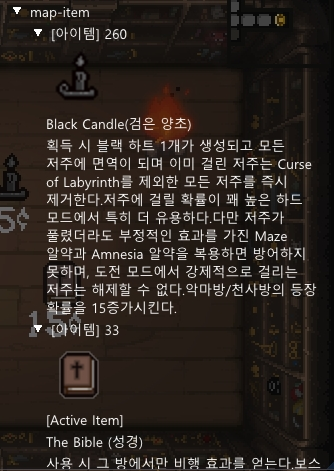

# isaac-helper
You can check items dropped from Isaac

README.md
- [english](./)
- [korean](./README-ko.md)

## Motivation
tired of searching

## Features
Show dropped items (collectibles/trinkets/cards/medicines) to the user before picking them up.

## Tech/Dependencies used
- **Tech**
	- dll injection
	- api & code hooking
-  **Dependencies**
	- asmjit
	- asmtk
	- imgui
		- glew
		- glfw
		- stb
	- LeksysINI
	- rapidcsv

## Installation
Requires`isaac afterbirth plus` and
[Visual Studio 2022 c++ x86 redistributable package](https://docs.microsoft.com/en-us/cpp/windows/latest-supported-vc-redist?view=msvc-170)

Download the binary from the release and run `loader.exe`.
Administrative rights may be required in some cases.

## Support Language
- korean

## How to Use?
In game press 'H' to bring up the menu.
Press the End key to exit the helper.

## Build Step

**Requires**
- `Visual Studio 2022` and `vstool cmake`
- Python 3.x
---
1. `git clone https://github.com/somersby10ml/isaac-helper --recurse-submodules`
2.  build asmjit/asmtk/glew/glfw (See the batch file.)
	1.  run `x86 Native Tools Command Prompt for VS 2022` and move `deps`
	2. Run the batch file. (See batch file content for details)
	3. lib file should be in deps/lib folder.
3. image extraction
	1. See Bin/data
	2. modify `1.ResourceExtractor.bat` GamePath and run
	3. run `2.ChangeFileName.py`
		( a_001_b.png -> 1.png )

## images

## source
[Item list text](https://namu.wiki/w/%EC%95%84%EC%9D%B4%EC%9E%91%EC%9D%98%20%EB%B2%88%EC%A0%9C)

## License
MIT

